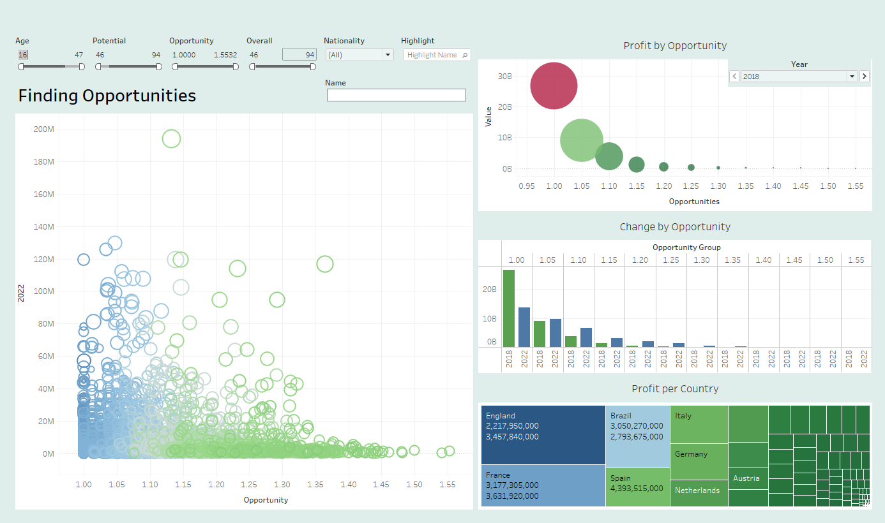
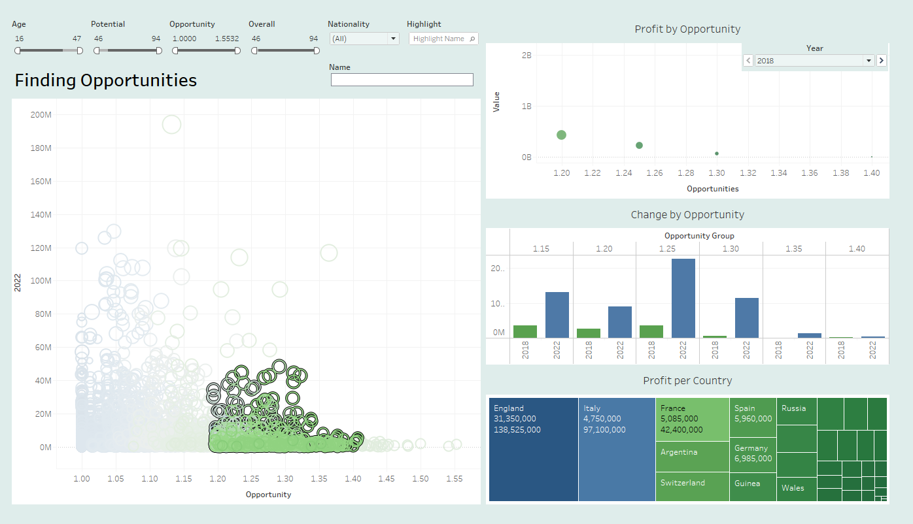

Manual for using the Finding Opportunities Dashboard
The Tableau dashboard showcases data about 16000 soccer players. The Scatterplot maps each of the players by an Opportunity ratio and current Value. You can filter the players by Opportunity, their Overall and Potential scores, Age, Nationality. You can also look up players by their Name. The color goes from blue to green as the age of the players decreases. 
On the right-hand side, we first have an animation that shows how the grouped Value of grouped Opportunities changes from 2018 to 2022. The next Chart is a more detailed stacked chart that shows what the Value changes and the Profit are for different opportunities.
The final chart is a heat map that displays the best opportunities by country, i.e. what countries are the best investments to consider.
Whatever filters you apply to the Scatterplot change the charts on right hand side. Select the data points, i.e., players, you are interested in on the scatterplot, and you can see their total values, profits, countries and opportunity categories reflected on the dashboard.

A team manager can use this dashboard to identify players and groups of players who may be valued less right now but have a good opportunity ratio to build a team.

Dashboard initially

 
Dashboard interactively changes after you make a selection.
